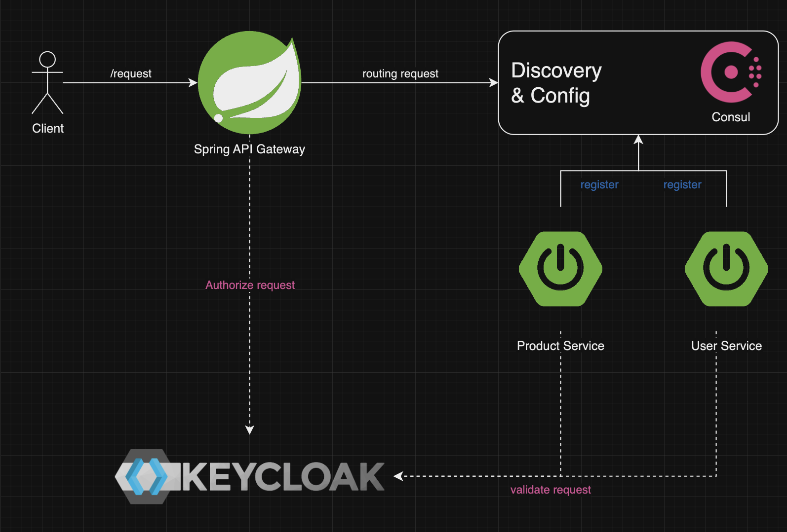

## Demonstration:
1. Spring Cloud Consul
2. Spring Gateway
3. Keycloak
4. Retry & Resilient

### Diagram


### Services:
1. Consul: http://localhost:8500
2. Keycloak: http://localhost:8180
3. Spring Gateway: http://localhost:8787
4. Spring Boot Product: http://localhost:4500
5. Spring Boot User service: http://localhost:4501

### How to start
1. Start Consul and Keycloak by Docker Compose
   
    ``docker compose up``

2. Start 3 Spring boot app: Gateway, Product, Service

   ``mvn spring-boot:run``
   
Credential Keycloak login:
1. Admin: ```admin/admin```
2. User: ``spring-learn-user/cool-programmer``

Credit to: https://cool-programmer.com/f/consul-microservices-communication-from-scratch?blogcategory=Microservices}
****
